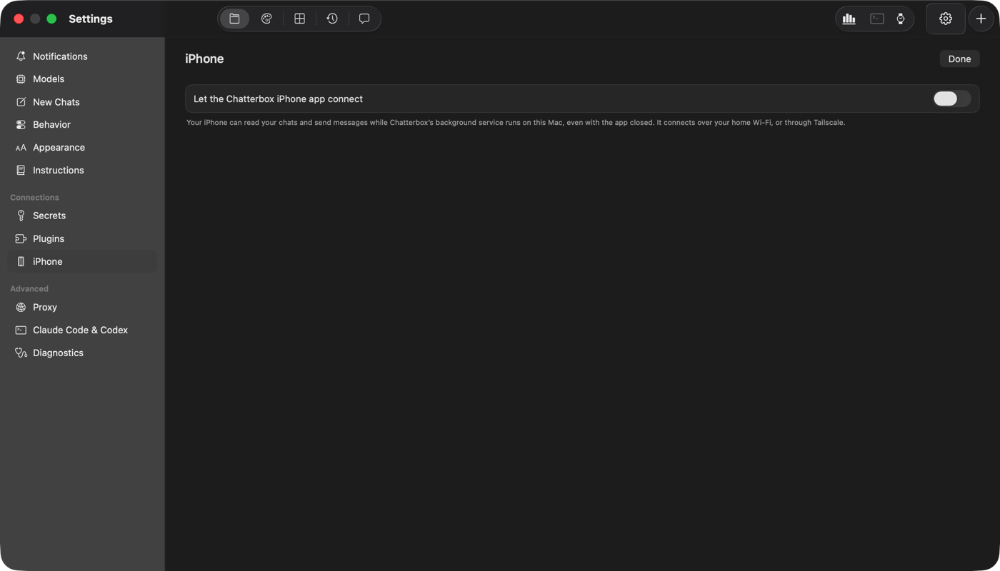
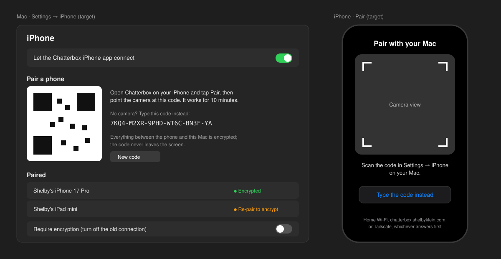
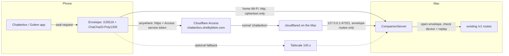

# Encrypted phone connection, then remote access through a Cloudflare tunnel

Issues: [#6 Encrypt and authenticate the mobile connection](https://github.com/shelbyklein/chatterbox/issues/6) (tasks T1–T6) and the tunnel issue (tasks T7–T10, link added once published).

## Summary

The Chatterbox and Golem iPhone apps talk to the Mac over plain HTTP. On home Wi-Fi, anyone on the
network could read the pairing code, the reusable login token, chats, uploads and the commands that
drive agents. This plan encrypts and authenticates that connection end to end (issue #6), pairing by
scanning a QR code. It then adds a Cloudflare tunnel at `chatterbox.shelbyklein.com` behind
Cloudflare Access, so the phone reaches the Mac from anywhere without Tailscale. Tailscale stays as an
optional fallback.

## Problem

**Today (evidence):**
- The phone builds `http://` URLs and sends a bearer token on every request
  (`Core/ChatterboxMobile/MobileStore.swift`: `request(host:path:…token:)`, pairing at `/v1/pair`).
- The Mac listens with plain TCP, no TLS (`Core/Chatterbox/Engine/CompanionServer.swift:88`,
  `NWParameters.tcp`, port 47321).
- Pairing is a 6-digit code (`CompanionServer.newCode()`, line 611). Fine as a login, too weak to
  authenticate a key exchange: an active attacker could try all million codes offline.
- The server answers home-network, link-local, Tailscale and **loopback** addresses
  (`allowed(ipv4Bytes:)`, line 650). A tunnel connector on the Mac arrives from loopback, so without
  changes internet traffic would reach today's unencrypted routes.
- Away from home the only route is Tailscale (`MobileStore.isTailscale`, the "turn on Tailscale"
  messages).

**Who it affects:** Shelby's iPhone and iPad (Chatterbox app) and the Golem iPhone app, on any network
that isn't fully trusted, and whenever Tailscale is off away from home.

**Wanted:** an attacker on the same Wi-Fi, or anywhere on the internet, can't read or alter traffic
or impersonate the Mac. The phone works away from home without Tailscale.

## Design

**Today:** Settings → iPhone, shown here with the connection switched off. Switched on, it adds the
6-digit code and the Mac's addresses.

**Target:** a QR code with a typed fallback, devices marked encrypted or not, "Require encryption", and
the phone's scanner.

**Flow:**

- **Identities.** The Mac gets a long-term X25519 identity key in its Keychain. Each phone makes its
  own key pair at pairing, kept in the phone's Keychain.
- **Pairing by QR.** Mac Settings shows a QR code with the Mac's addresses, its public key and a
  one-time 128-bit secret, valid for 10 minutes. The phone scans it, sends its public key and proof of
  the secret (HMAC over both keys), and stores the Mac's key: that pins the Mac's identity. The secret
  never travels. A typed fallback shows the same secret as a ~26-character code.
- **Every request after pairing** is one `POST /v1/secure` envelope. Method, path, headers and body
  are sealed with ChaCha20-Poly1305, under a key from X25519(phone, Mac) plus HKDF. Each envelope
  carries the device ID, a timestamp and a counter; the Mac rejects replays and stale timestamps.
  Responses are sealed the same way. Large downloads and uploads go in sealed chunks. A server without
  the pinned Mac key can't produce a valid response, so the phone stops before sending anything else.
- **The tunnel.** Its own named tunnel `chatterbox`, with its own config file (the Mac's default
  `~/.cloudflared/config.yml` points at the `agentos` tunnel and stays untouched), run by a launch
  agent. Ingress `chatterbox.shelbyklein.com → http://127.0.0.1:47321`, never the agents' port
  47320. Cloudflare Access allows only requests carrying the service token. The Mac answers loopback
  connections only on the envelope routes.
- **Phone routes:** home Wi-Fi (Bonjour or saved address), then the tunnel, then Tailscale if it's on.
  The service token reaches the phone inside the encrypted channel, never typed on the phone.
- **Legacy.** Until both apps are updated and re-paired, the Mac still accepts today's plaintext
  requests from home/Tailscale addresses (never from the tunnel). Settings → iPhone gets "Require
  encryption" to turn that off; it switches on by itself once no plaintext device remains.

## Settled decisions

| Decision | Choice |
|---|---|
| Encryption | End to end, keys from pairing; Cloudflare sees only ciphertext |
| Tunnel lock | Cloudflare Access service token |
| Tailscale | Kept as a fallback route |
| Hostname | `chatterbox.shelbyklein.com` |
| Pairing | Scan a QR code; typed long code as a fallback |
| Golem iPhone app | Included: the shared phone code is in Core; the Golem chat adopts it in its app |
| Existing pairings | Re-pair once by scanning the QR code (a token sent in plaintext can't safely bootstrap keys) |

## Success criteria

1. **Wi-Fi capture shows nothing readable.** `tcpdump` on the Mac's Wi-Fi interface while the phone
   pairs, sends a message with a marker string and uploads a marked image: the capture contains
   neither marker, nor the token, nor "Bearer". Verified with a script over the saved capture.
2. **Impersonation is refused before anything is sent.** A test server presenting a different Mac key
   gets no device token or request body, and the phone shows "This isn't your Mac." Verified in the
   envelope test harness.
3. **Away from home without Tailscale.** iPhone on cellular, Tailscale off: chat list loads, a message
   sends and a reply arrives via `chatterbox.shelbyklein.com`. Verified on the installed app.
4. **The internet can't get in.** `curl` to `chatterbox.shelbyklein.com` without the service token is
   refused at Cloudflare (403/redirect) and nothing appears in the Mac's companion log; with the token
   but a plaintext request, the Mac refuses it. Verified by commands.
5. **Migration works.** After updating, each existing device re-pairs with one QR scan. With "Require
   encryption" on, a legacy plaintext request is refused. Verified on the installed apps and in the
   harness.

## Deliverables

| Item | End state |
|---|---|
| Core: envelope crypto, QR pairing, sealed client (Shared + ChatterboxMobile) | committed and pushed |
| Mac: secure pairing, `/v1/secure` dispatch, legacy gate, Settings QR + "Require encryption" | committed, pushed, installed |
| Chatterbox iPhone app: QR scanner, sealed requests, routes incl. tunnel | committed; installed on iPhone (TestFlight or cable) after Shelby's go-ahead |
| Golem iPhone app adoption | handed to the Golem Development chat; adopted there |
| Test harness: envelope, replay, tamper, impersonation; capture script | committed |
| Tunnel `chatterbox`, DNS record, launch agent, config in `deploy/chatterbox-tunnel/` (no credentials) | created and running after Shelby's go-ahead |
| Cloudflare Access app + service token | made by Shelby in the dashboard; token entered in Mac Settings |
| Docs: `docs/remote-access.md` | committed |
| Issue #6 | closed after Shelby's go-ahead |

## Workflow

| ID | Task | Acceptance check |
|---|---|---|
| T1 | Envelope crypto in `Core/Shared` (identity keys, QR payload, pairing proof, seal/open, replay window, chunked bodies) | Unit harness: round trip, wrong key fails, tamper fails, replayed or stale envelope fails |
| T2 | Mac: identity key in Keychain, QR pairing endpoint, `/v1/secure` dispatching to existing routes, loopback limited to envelope routes, legacy plaintext gate | Harness against an isolated service: sealed chat list matches plaintext; loopback plaintext refused; legacy works only with the gate open |
| T3 | Mac Settings → iPhone: QR code with typed fallback, paired devices marked encrypted or legacy, "Require encryption" | Rendered Settings check; QR decodes to the expected payload |
| T4 | Chatterbox iPhone app: QR scanner pairing (camera permission), pinned Mac key, every request sealed, downloads/uploads chunked | Simulator: pairs from a QR image, loads chats, sends, downloads a PDF; impersonating server refused (criterion 2) |
| T5 | Golem app hand-off: message the Golem Development chat with the Core API and migration steps | Golem chat confirms adoption, or the plan records it as pending |
| T6 | Verify #6 on Wi-Fi | **Gate: Shelby installs the Mac and iPhone builds.** Then the capture script passes (criterion 1) and migration works (criterion 5) |
| T7 | Tunnel: create `chatterbox`, own config, DNS `chatterbox.shelbyklein.com`, launch agent; save config to `deploy/chatterbox-tunnel/` | **Gate: Shelby's OK to publish the hostname.** `cloudflared tunnel info chatterbox` shows connections; DNS points at this tunnel's ID, not `agentos` |
| T8 | Access | **Gate: Shelby creates the Access app (Self-hosted, `chatterbox.shelbyklein.com`, Service Auth policy) and a service token, and enters it in Mac Settings.** `curl` without the token is refused (criterion 4) |
| T9 | Phone routes: Wi-Fi → tunnel (Access headers) → Tailscale; token delivered over the sealed channel | Simulator with the LAN address unreachable uses the tunnel; installed iPhone on cellular works (criterion 3) |
| T10 | Docs, cleanup, close-out | `docs/remote-access.md` committed; tidy clean; **Gate: Shelby's OK to close #6** |

## Scope boundaries

**Not included:** the PWA; the agents' local API (port 47320) stays loopback-only and is never
tunnelled; changing how push notifications are delivered; removing Tailscale support; the Golem app's
own UI beyond adopting the shared code; anything in the `agentos` or other existing tunnels.

**Must not change:** Bonjour discovery at home; chats, drafts and attachments; push registration and
delivery; the agent API and its token; existing tunnels and DNS records; existing paired devices keep
working (legacy) until re-paired or "Require encryption" is turned on.

## Test plan

- `./scripts/test-companion-envelope.sh` (new, T1–T2): crypto unit checks and an isolated-service
  round trip covering seal/open, wrong key, tamper, replay, stale timestamp, legacy gate and loopback
  restriction.
- Existing suites stay green: `./scripts/test-mobile-idempotency.sh`, `./scripts/test-mobile-composer.sh`,
  `./scripts/test-mobile-pdf.sh`, `./scripts/test-mobile-push.sh`, `./scripts/test-chatterbox-daemon.sh`,
  `/usr/bin/python3 tests/golem-integration/rpc.py`.
- UI: Mac Settings → iPhone render (QR visible, device states); iPhone simulator pairing from a QR
  image and the chat list loading, screenshot checked.
- Wi-Fi: `scripts/capture-companion.sh` (new) records the Mac's Wi-Fi interface during a scripted
  phone session and searches the capture for the markers and token (criterion 1).
- Tunnel: `curl` checks with and without the service token (criterion 4); installed iPhone on
  cellular (criterion 3).

## Rollback

- **App builds:** reinstall the previous build; "Require encryption" off restores legacy access. The
  Mac keeps device records for both modes, so nothing re-pairs on rollback.
- **Pairing data:** the Mac identity key and device public keys live in new Keychain items and a new
  field in the device list; old fields stay. Before T2 ships, the device list file is backed up next
  to itself (`devices.json.before-encryption`).
- **Tunnel:** `launchctl bootout` the launch agent, `cloudflared tunnel delete chatterbox`, delete the
  `chatterbox` DNS record, and delete the Access app. Nothing else in Cloudflare is touched.

## Open questions (none blocking)

- Whether to distribute the iPhone build through TestFlight first (needs the App Store Connect
  setup in `docs/testflight.md`) or by cable. Either works for T6.
- How long the Mac stays reachable while asleep: the tunnel only works while the Mac is awake
  ("Keep this Mac awake" is on today).

## Work preparation

- Scope: confirmed in chat on 2026-10-07 (encryption end to end; Access service token; Tailscale kept
  as fallback; `chatterbox.shelbyklein.com`; QR pairing; Golem app included, coordinated).
- Mode: `linear`. The work is one security-critical chain through shared files (CompanionAPI,
  CompanionServer, MobileStore), so parallel lanes would conflict and split review of the crypto.
- Models: executor `claude-opus-5-5` (this session), medium effort.
- Now/later: pending.
- Tracking: local plan; issue #6 and the new tunnel issue get this plan once Shelby OKs publishing.
- Readiness: pass · 2026-10-07 · R7 via this local plan until published.
