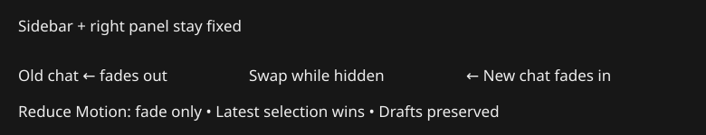

# Smooth Mac chat switching
Switching chats currently replaces the keyed ChatView immediately, then expands its initial transcript page and repositions the newest message. Shelby reports about a second of visible settling. Stage the replacement behind a brief fade: outgoing content moves slightly left, new content enters from the right, while columns remain stationary.

Current layout: [native Golem capture](/Users/shelbyklein/Chatterbox/Screenshots/mac-unified-columns/golem-1100.png).

Tracker: local:05E16D87-F743-40C8-822F-276294F0CBEE

Success criteria: the swap occurs only with the chat hidden; rapid selection settles on the newest ID; Reduce Motion never slides; drafts are unchanged; sidebar remains interactive while outgoing chat is disabled. Verify coordinator tests and native ContentView captures of Golem and regular chats. This masks layout work, it does not promise to remove main-thread stalls.

Tasks: FADE-1 implement cancellation-safe staged switching and input gating, tested with normal/rapid/alternate/Reduce Motion cases. FADE-2 exercise real native ContentView with isolated copied histories and inspect captures; assert drafts and column bounds. FADE-3 build, commit/push and install Mac under standing authorization; verify binary and launch.
Deliver code, plan and regression tests committed/pushed; installed Mac build. Preserve mobile, transcript data, routing, model settings and worktrees. No external model requests or paid services. No blocking questions.
Rollback: back up installed app before replacement; restore that bundle or revert scoped commit. No stored data/schema changes.
Work preparation: R1–R13 pass; linear GPT-6.1-Sol Medium, no delegation. Run swiftc coordinator tests, native whole-source harness, signed xcodebuild and scripts/install.sh. Existing transcript entry tasks remain active while hidden; short staging window covers their initial deferred layout. Changes from Settings/web/mini bypass chat-to-chat staging.

## Verification
FADE-1/2 passed: coordinator includes delayed mounting; native production-library captures show outgoing content, blank hidden replacement and incoming content. Rapid selections finish on latest chat. Golem/project drafts and transcript counts remain unchanged;800pt pane bounds pass. Reduce Motion verified in coordinator, not via the OS toggle. Full evidence: tests/chat-switch/verification.md.

