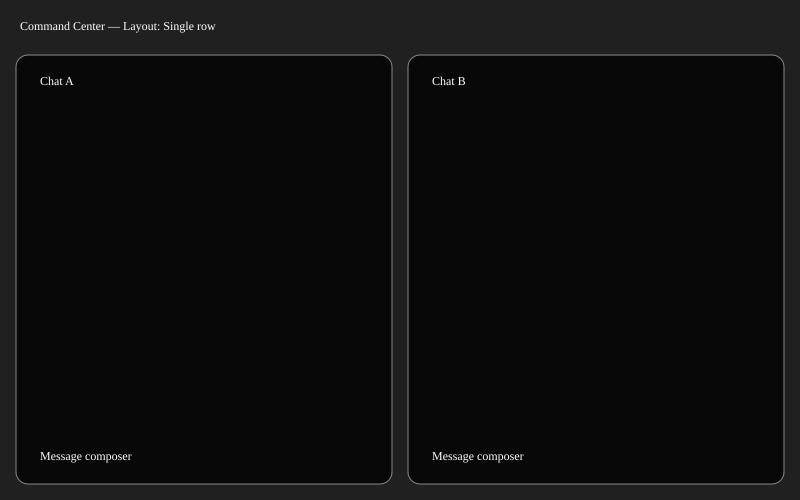

# Command Center single row

Add an explicit Single row arrangement that uses the available window height. Today tiles have fixed heights and columns can leave a large empty area, as shown in Shelby's screenshot. Grid mode remains the default; narrow single-row windows scroll horizontally with 400-point minimum tile widths.

Current evidence: `/Users/shelbyklein/Library/Application Support/CleanShot/media/media_GAvh2phfKh/CleanShot 2026-10-04 at 10.29.12 AM@2x.png`.

Work preparation: user explicitly requested implementation now. Linear execution in this Codex session (session handoff identifies GPT-6.1-Sol Medium); one shared view change needs no delegation. Local tracking only under standing prohibition on GitHub issue edits. Readiness R1-R13 pass: scope settled, visual supplied, checks below, no blocking questions.

Success: one persisted row fills remaining height; narrow windows retain usable width; grid settings, independent drafts and history survive mode switching. Deliver source, scoped commit/push, verified Mac build/install under standing authorization.

- [x] ROW1: add persistent arrangement and window-height layout; preserve grid defaults.
- [x] ROW2: run `scripts/test-command-center.sh`, covering heights, persistence and independent composers; inspect wide/narrow single-row production-view captures.
- [x] ROW3: commit/push, back up installed bundle, install Mac update and verify build identity/process.

No mobile, service, provider, pairing, history, draft or project changes. No data migration. Rollback: select Grid; to revert bundle use pre-install backup with matching daemon-compatible current lineage. New preference is additive and can be ignored by old UI. Native menu clicks and installed interaction verification are reported separately from harness checks.

Verification: Debug build passed; command-center suite passed in `/tmp/chatterbox-command-center.MjUCo1` (persistence, equal row geometry, usable narrow widths, independent drafts, native switch/add/remove). Inspected two-chat dark and narrow light production-view renders. Layout selection in the harness is set through the model; actual menu clicks are unverified.

Installed and relaunched on Mac; installed dylib matches built binary. Source pushed as `369c4c4`. Backup `/tmp/Chatterbox-before-single-row.app`. Installed menu interaction remains user verification.
