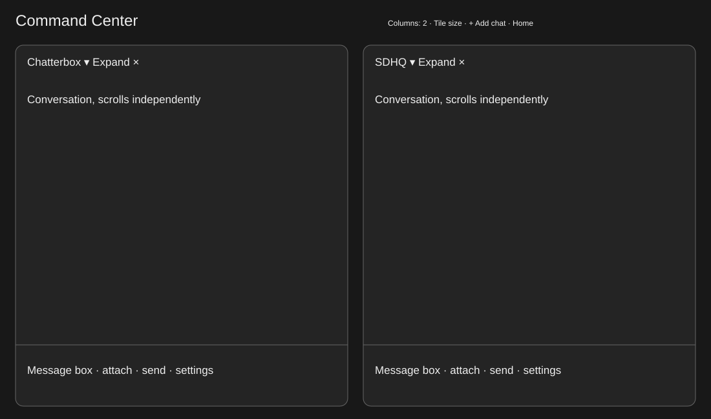

# Command Center

local: plans/command-center.md

Mac Home provides cards that open one thread; it cannot show several live conversations together. Add a full-window Command Center with independently scrollable chat/composer tiles, add/remove and per-tile thread switching. Shelby explicitly chose chat conversations only, and authorized implementation with “build it.” A composer is the existing typing/attachments/send area.

Current: [Home proof](/Users/shelbyklein/Chatterbox/Screenshots/mac-home/home-wide.png). Target: .

Success criteria: tile add/switch/remove never changes or archives a thread; history/drafts remain per-session and only one tile can show a session; grid adapts to narrow/wide windows; saved tiles/column preference survive remount/relaunch; typing, paste and keyboard shortcuts target only the active tile. Existing main chat behavior remains intact.

Deliverables: code, regression harness, inspected native screenshots, plan committed/pushed; Mac built/installed/restarted under standing authority. No mobile update, shell grid, provider/routing/permissions changes or automatic submissions. Tile removal keeps the chat running and saved. Golem mini retains exclusive ownership of its composer.

| Task | Acceptance |
| --- | --- |
| CENTER1 | Persisted tile layout/controller, responsive grid, Home/toolbar entry and per-tile chooser/removal/expand. Controller tests prove uniqueness and no transcript mutation. |
| CENTER2 | Embed production ChatView with scoped focus/keyboard behavior and no duplicate window toolbars. Native multi-composer typing/switch/remove checks preserve drafts; render narrow/wide. |
| CENTER3 | Build and regression checks; commit/push/install; match installed code and verify process/API. |

- [x] CENTER1
- [x] CENTER2
- [ ] CENTER3

Tests: scripts/test-command-center.sh isolated AppModel/data/ports/defaults, no provider turns; existing scripts/test-mac-home.sh regression. Render real CommandCenterView/ChatView; exercise controls/native text views. xcodebuild Debug, scripts/install.sh.

Rollback: prior app bundle backed up before install; revert scoped commits/reinstall. Saved tile UUIDs and layout preferences are UI-only; remove their keys to reset without touching conversation files.

Settled: chat-only tiles with composer, no shell terminals; inherit existing Mac design and model settings. No blocking questions. Switching a tile changes its displayed session, never its project folder. Existing project worktrees/Sidechats selectable.

Work preparation: linear GPT-6.1-Sol Medium, one shared UI/focus dependency chain; readiness R1–R13 pass. Direct implementation request supplies now authorization; track local under standing restriction on GitHub issue writes. Preserve other agents/worktrees.

Verification: Debug build and scripts/test-command-center.sh pass, fixture /tmp/chatterbox-command-center.nbL64U. Real production ContentView/ChatView renders inspected: two chats, four chats at 1200pt, one-column adaptive 640pt light mode, native chooser. Native text views prove focus switches to each owner, independent drafts, and an inactive stale Return cannot send or clear another draft. Native switch button/chooser selection, Add chat/chooser selection and remove button all pass; removed/switched threads remain unarchived with exact transcript JSON unchanged. Controller covers uniqueness, persistence/reload, missing-session reconciliation and 1–4 column fitting. Existing Mac Home regression passes (/tmp/chatterbox-mac-home.BpB5U5).

Proof: [four-chat grid](/Users/shelbyklein/Chatterbox/Screenshots/command-center/four-chats.png), [narrow](/Users/shelbyklein/Chatterbox/Screenshots/command-center/narrow.png), [chooser](/Users/shelbyklein/Chatterbox/Screenshots/command-center/chooser.png).

Limits: no messages submitted to real providers in fixture tests; streaming/send uses the existing ChatSession engine. Clipboard image paste, VoiceOver speech, live Golem mini interaction and embedded preview links not manually exercised. Scope of native focus and shortcuts is implemented with the tile context; regular single-chat context remains default-active. No shell-mode grid added.
