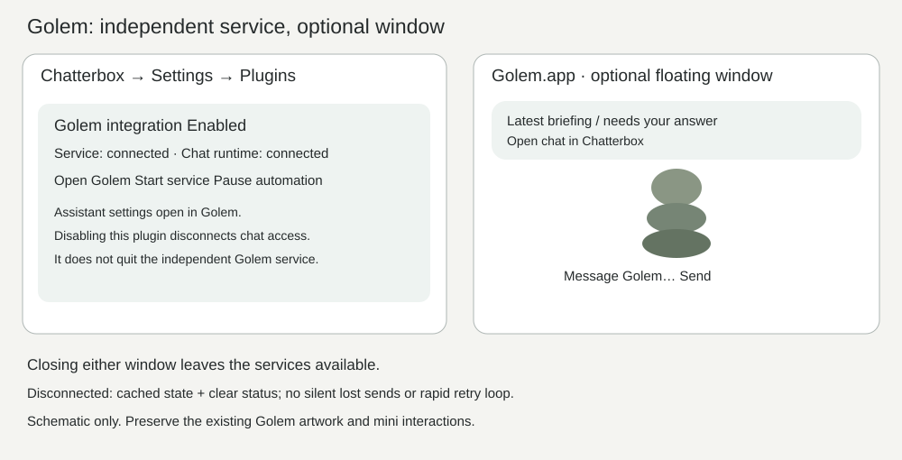
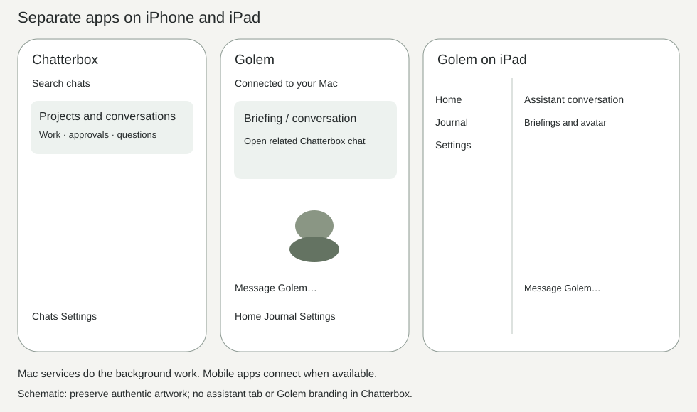
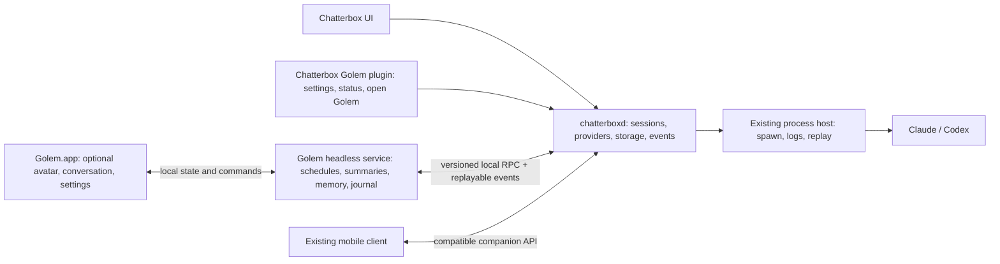

<!-- golem-app-split-2026-10-04 -->
# Standalone Golem with headless services and a Chatterbox integration plugin

## Summary
Separate Golem from Chatterbox on macOS, iPhone and iPad. A headless Golem service performs assistant work through `chatterboxd`; Golem.app and a separate universal iOS/iPadOS Golem app provide optional interfaces. Chatterbox keeps ordinary chat workflows and a small optional integration plugin, so assistant rendering and automation no longer share its UI lifecycle. Measure responsiveness and total resource use before and after; process separation alone is not a promised CPU reduction.

## Work preparation
- Scope: confirmed by the user's planning request and corrections on 2026-10-04: headless operation through chatterboxd, separate Golem mobile app, removal of Golem from Chatterbox iOS/iPadOS.
- Repository: shelbyklein/chatterbox; worktree `/Users/shelbyklein/Vibes/Chatterbox-golem`, branch `golem`, baseline `f98224c63e06d0f28a047339a657f15726ebaeb8`.
- Local plan: `plans/golem-app.md`; issue: https://github.com/shelbyklein/chatterbox/issues/31.
- Tracker Trapper plan: `32531F4C-0017-40BD-BA89-F4E5BA56623F`; stable todos `GOLEM-01` through `GOLEM-09`; current acceptance is tracked below. Planning run: `8AEE8672-70C3-46F0-8477-20A35370BB69`; verified session watcher linked.
- Published issue contains the full plan; relative assets also exist under this worktree in `plans/assets/golem-app/`. Local plan/assets are saved, uncommitted; implementation delivery will commit them with the feature.
- Mode: **linear**. Runtime ownership and compatibility must land before assistant extraction; one executor avoids competing edits to shared persistence, protocol and generated project files.
- Executor: **GPT-6.1 Sol (`gpt-6.1-sol`), medium effort**, verified from this session's turn_context. No agents dispatched; no handoff recipient.
- Implementation: authorized by the user’s “now” on 2026-10-04. GOLEM-01 through GOLEM-05 and GOLEM-07 source checks accepted; GOLEM-06 and GOLEM-08 review pending; GOLEM-09 Mac activation verified; physical/provider/rollback acceptance pending.
- Readiness: **pass · 2026-10-04 · R1–R13**, after local asset, tracker and GitHub readback checks. No waivers. Activation is an explicitly later user gate.
- Existing main checkout has unfinished `GolemMiniWindow.swift`, mini-hover-ack plan and tests. Do not overwrite or absorb that work; reconcile its owner before extracting the mini. Other worktrees also exist; recheck before implementation.

## Current behavior and evidence
Observed at the baseline above:
- `AppModel.swift: init()` starts DotActivity, EmailWatch, avatar loading and assistant computer inspection with the Mac UI. `AppModel` owns conversation loading and saves.
- `DotActivity.swift` schedules check-ins and reacts to waiting/finished chats; it references AppModel/ChatSession. `EmailWatch.swift` has a minute timer and performs sweeps every 15/30 minutes. `GolemJournal.swift` synchronously saves journal JSON on the main actor.
- `Shared/GolemRigView.swift:14` schedules 30 fps drawing; its pause condition is Reduce Motion. `GolemMiniWindow.swift` hosts assistant UI in Chatterbox's process (hiding currently releases that host).
- `NextSteps.swift: ChatterboxPlugin` is a built-in enum with feature toggles, not an external code-loading system. The planned Golem plugin is a lightweight built-in adapter to an external service; no plugin marketplace is required.
- `ChatterboxHost/Host.swift` and `Support/HostProtocol.swift` offer process spawn/attach/write/kill/log replay, not a durable conversation API. The host can exit after 60 seconds idle and idle providers can exit while detached. No `chatterboxd` implementation was found in this checkout, main checkout, or matching repository issues during this investigation. Treat the daemon conversation layer as an explicit prerequisite, not an already verified service. If another lane supplies it, verify its contract and reuse it before writing competing runtime code.
- `CompanionServer.swift` depends on AppModel for local and mobile chat APIs. Existing MCP tools communicate with that UI-hosted API. These routes cannot simply be redirected to the current raw process host.
- `ChatterboxMobileApp.swift` uses MobileHome on iPhone and ChatListView on iPad. MobileHome defaults to Golem; MobileGolem, ChatDetailView and Cards contain assistant-specific presentation. The mobile icon is Golem artwork. Pairing and push assume the Mac app is open.
- Initial live snapshot: Chatterbox PID 6040 used 81.7% CPU; a three-second sample showed live rig drawing alongside other UI work. This is a diagnostic clue, not attribution or a repeatable benchmark. Re-measure in T1.

### Visual evidence and proposed flow
Historical native captures copied from the existing project's verification artifacts; these document embedded Golem UI, not current runtime acceptance. Live screencapture returned `could not create image from window` during planning.

Historical Mac/mobile captures remain local and excluded from public source delivery because they contain personal chat/email content. Current acceptance captures use isolated fixture data.





Diagram source: [flow.mmd](assets/golem-app/flow.mmd). Mockups are schematic, not approved visual redesigns.

## Settled architecture and behavior
### Runtime ownership
- Add a Foundation-based conversation core and `chatterboxd` target in this repository. The daemon owns conversations, provider sessions, queues, tool/approval/question state, transcript persistence and ordered events. Existing ChatterboxHost remains the process/log supervisor behind it. No second competing Codex session manager or direct JSON writer in either UI.
- Extract engine logic from AppKit/SwiftUI dependencies; UI models become observable projections and send explicit commands. The daemon owns persisted chat settings; platform preferences and window geometry stay in the corresponding app. Provider sessions and existing sign-ins remain in use.
- Add a headless Golem service (`golemd`) and optional Golem macOS app target. The service owns assistant policies, scheduled triggers, email monitoring, summaries, shared memory coordination and journal writes. Assistant conversation and provider execution remain daemon-owned; Golem requests turns and consumes results.
- Keep source in separate target directories within the same repo for atomic integration and migration. This is application/process separation, not a requirement to create another GitHub repository. Shared protocol/model code must not import either product's UI. Compile the rig into Golem targets only after Mac/mobile extraction.
- Both services run per logged-in user using LaunchAgents, with signed executable paths, single-instance locks, opt-in background enablement, crash backoff and explicit stop/status controls. A dev environment uses isolated directories, sockets, ports and labels. Do not install or enable live agents during implementation testing without activation approval.
- Headless means no visible window is required. Closing a window preserves service work. Quitting Golem.app closes its UI; Stop Golem Service stops automation. Quitting Chatterbox.app does not kill the daemon. Preserve the existing Keep replies running preference: when disabled, quitting interrupts user-chat turns owned by that UI, not unrelated Golem work. Explain these distinct controls in settings. Services pause during Mac sleep and reconnect/catch up after wake; do not introduce forced keep-awake behavior.

### Integration contract
- Local daemon RPC over a Unix socket with 0700 directory/0600 socket permissions and verified peer identity; supported macOS clients receive explicit capabilities. Do not reuse the broad agent token as a privileged UI credential. Golem may read approved chats, submit messages, start/stop authorized work, and suggest answers; it may never approve requests or submit user answers. Trusted user interfaces use a separate capability for those commands.
- Version/capability handshake; explicit unsupported-version, not-ready, unavailable and permission-denied errors. Commands use request IDs/idempotency keys. Events include monotonically ordered sequence, chat ID, revision, kind and bounded payload; reconnect from persisted cursor, with snapshot/resync when retention expires. Deduplicate triggers and acknowledged results. Bounded queues, backpressure, event coalescing and exponential retry backoff avoid full transcript scans or rapid polling.
- Required events: chat created/changed/archived, turn started/progress/finished/interrupted, approval/question waiting/resolved, suggestion changed and runtime health. Fetch paged transcript detail on demand. Never send whole archives on every token.
- Keep existing companion `/v1` schemas, revisions, mutation idempotency and MCP tool names working via daemon-backed adapters. Move Bonjour, pairing storage and remote companion listening into the daemon; local RPC remains separate from network access. Move computer APIs into a headless runtime adapter while preserving project tool reach and the existing Docker profile/downloads/preview relays (related issue #22).
- Chatterbox Settings → Plugins gains Golem connection enablement/status and Open Golem. Cmd-J and existing assistant shortcuts become launch/focus links to Golem.app. No animation, email sweeps or scheduling remains in the Chatterbox UI process.
- Turning the plugin off revokes Golem's chat integration and suppresses integration-triggered tasks. It does not terminate an independently enabled Golem service or its unrelated jobs. Display that distinction. With Golem absent or disabled, regular chats, approvals, notifications and provider execution remain fully functional.

### Separate mobile products
- Preserve the existing Chatterbox mobile bundle ID and pairing. Both iPhone and iPad start on ordinary chats; remove Golem home/tab, animated headers, assistant sidebar entries, Golem asset downloads, assistant settings and Golem icon branding. Keep generic suggestion cards with attribution and user-only submission; these are chat interactions, not an embedded assistant screen. Historical assistant conversation data remains on the daemon and is accessed through Golem.
- Add GolemMobile, a universal iPhone/iPad app with its own bundle ID, icon, onboarding, conversation/briefing UI, journal, settings and notifications. iPhone uses compact navigation; iPad uses adaptive split navigation, rotation and multitasking. It connects to Golem's Mac service through an authenticated, daemon-hosted companion gateway, with explicit Golem availability state.
- Separate app-scoped pairing/permissions and APNs topics/tokens. Do not copy Chatterbox's token from one iOS sandbox to the other. New Golem users pair through explicit onboarding; current Chatterbox pairing continues unchanged. Authorized links open the relevant Chatterbox chat; fallback explains when Chatterbox is not installed. Neither mobile app continuously executes Mac assistant jobs in the iOS background.
- Golem briefings/mail/check-ins notify Golem clients; ordinary work and approvals notify Chatterbox clients. Use event identity to avoid duplicate alerts across daemon/service/UI and suppress read items. Golem suggestions do not suppress required Chatterbox approval alerts. Validate sandbox and production APNs topics independently; account/provisioning setup may need the user at activation, and must not be reported verified until tested.

### Data and migration
- `chatterboxd` is the sole writer to existing Conversations/Attachments and provider resume offsets. Stage a versioned ownership marker and lock; stop the legacy writer before daemon adoption. The updated UI refuses legacy write mode when daemon ownership is active. Do not run an older installed app concurrently against adopted data.
- Keep `~/Chatterbox/Dot`, its avatar, memory folder and journal paths for v1; changing working directory would alter Claude memory identity. Golem exclusively writes its journal/preferences after ownership transfer. Migrate only assistant-specific UserDefaults by an explicit key allowlist into Golem's domain; keep source values and an import record. Preserve conversation UUID/isDot, backend history, queue/drafts/attachments, unread state and existing mobile device registrations.
- Back up the app bundle, conversation store, host/provider offsets, pairing/push registrations, assistant directory, memory and relevant preferences before live adoption. Use a quiesced snapshot; never print secrets. An import is retryable and verified by counts/hashes plus transcript/draft readback.

## Plan-level success criteria
1. With both desktop UIs closed, isolated headless fixtures execute a normal chat turn and a Golem scheduled/event-triggered turn, persist the result, and show it once on reconnect; no app launch required.
2. Chatterbox Mac/iPhone/iPad have no embedded Golem rig, automatic jobs or assistant home UI. Separate Golem Mac/iPhone/iPad interfaces preserve conversation, mini and assistant interactions, verified by native captures at actual entry points.
3. Migration keeps all existing chats, UUIDs, attachments, drafts, memory identity, pending approvals, provider replay offsets and Chatterbox pairings; daemon is the only writer. Fixture fault/retry/rollback tests prove no duplicate rows or sends.
4. Repeatable performance report compares legacy combined UI, new Chatterbox alone, new Golem visible and new services headless. Over three identical 60-second idle runs, median Chatterbox process CPU is <=5%, chat-switch median/p95 and main-thread stall time regress <=10%, and combined-process idle CPU does not exceed baseline by >10%. If baseline cost is near zero, allow at most one CPU percentage point measurement noise. Hidden Golem UI has no render ticks; headless services show no animation work. Failing budgets block performance acceptance rather than relaxing thresholds silently.
5. Stop/disconnect/crash/relaunch/sleep-wake, plugin disablement, unavailable server, invalid capability and notification routing pass on desktop and both mobile sizes. Service health and version mismatch are visible; no silent lost messages or duplicate automation.

## Deliverables and end states
- Runtime/protocol, services, Mac apps/plugin and universal Golem mobile target: reviewed scoped commits and draft PR, with Debug/simulator builds and acceptance artifacts. Implementation authorization does not itself authorize merge, release or installation.
- Migration, backup/restore and lifecycle runbook; performance report and screenshots: committed with the feature before review.
- Plan, diagrams and GitHub issue: published planning records. Tracker implementation todos remain pending until their individual checks pass.
- Installed signed Mac apps/LaunchAgents, physical iPhone/iPad builds, real push and headless runtime checks: awaiting explicit activation approval after the tested result is concrete. TestFlight/App Store distribution is excluded.

## Dependency-ordered implementation checklist
Stable task IDs below must match Tracker Trapper and the GitHub checklist one to one. Each implementation todo remains pending during planning.

- [x] GOLEM-01 — Baseline and ownership inventory. Acceptance: record three idle/headless-equivalent CPU runs and repeatable chat-switch median/p95/stall results; classify UI versus runtime dependencies; reconcile main's mini work and any daemon lane without editing their files. Save commands/fixtures and report under tests/golem-integration/artifacts. Depends: none.
- [x] GOLEM-02 — Extract the daemon conversation core. Acceptance: fake Claude/Codex turn, steer, stop, question, approval, queue and replay complete with no AppModel/NSApplication process; restart has exactly one copy of every row and one store writer. Existing host behavior remains passing. Depends: 01.
- [x] GOLEM-03 — Versioned RPC, events and compatible client adapters. Acceptance: UI projection, local MCP and mobile /v1 contract tests pass; wrong capability/peer is rejected; retries send once; event cursor replay and expired-cursor resync converge; Chatterbox UI reconnects without spawning a duplicate provider or writer. Depends: 02.
- [x] GOLEM-04 — Extract Golem's headless service. Acceptance: scheduled check-in, finished/waiting summary and email fixture execute with both UIs absent; journal/memory identity preserved; replay, sleep/wake and service restart produce no duplicate job/briefing; Stop Service halts future automation; independent pause controls work. Depends: 03.
- [x] GOLEM-05 — Separate Mac Golem app and Chatterbox plugin. Acceptance: actual plugin toggle/Open Golem/Cmd-J exercise the external app; mini drag/collapse/expand/drafts/model controls and conversation render pass; no Golem UI ticks or jobs remain in Chatterbox; Golem window close and quit preserve service state, while Stop Service stops it. Render connected/disconnected/disabled/reduced-motion states and inspect captures. Depends: 04.
- [ ] GOLEM-06 — Standalone Golem iPhone/iPad app and Chatterbox removal. Acceptance: both targets build; Chatterbox opens chats with no assistant UI or Golem branding; Golem supports conversation, journal, settings, pairing/revocation and cross-app links on iPhone and iPad; rotation, split view, keyboard, accessibility and offline/reconnect captures inspected; existing Chatterbox pairing remains valid. Depends: 03,04,05.
- [x] GOLEM-07 — Notifications, migration and service packaging. Acceptance: app-specific push registration/topic fixtures and notifications route once to the intended product; real push checked only after approval/provisioning; ownership migration retry and restore tests preserve counts/hashes/drafts/approval state; no concurrent legacy writer; dev LaunchAgents start/stop/recover once, including daemon/service restart. Depends: 05,06.
- [ ] GOLEM-08 — End-to-end regression and performance acceptance. Acceptance: all listed suites pass, headless provider fixtures pass with UIs absent, native UI captures inspected, each success criterion has evidence, and performance budgets pass. Deliver scoped commits/draft PR and signed build artifacts for review; live install/physical checks explicitly pending. Depends: 07.
- [ ] GOLEM-09 — Approved activation and installed verification. Human gate: obtain approval for the concrete bundles, backup/migration and background agents before installing or restarting current apps. Acceptance: verified backups, installed signature/build identity, real headless turn with user-approved provider request, physical iPhone/iPad pairing and correct real push; rollback rehearsal recorded. Merge/release/issue closure require their own explicit authorization unless already supplied. Depends: 08.

## Test plan and commands
No runtime tests execute during planning. New scripts below are implementation deliverables, not existing commands claimed to work today.

Existing suites to retain/adapt:
```sh
./scripts/test-golem-mini.sh
./scripts/test-chat-switch.sh
PERF_ROUNDS=8 ./scripts/test-chat-switch-perf.sh
./scripts/test-chat-rendering.sh
./scripts/test-transcript-paging.sh
./scripts/test-unified-columns.sh
./scripts/test-mobile-conversation.sh
./scripts/test-mobile-composer.sh
./scripts/test-mobile-scroll.sh
./scripts/test-mobile-refresh.sh
./scripts/test-mobile-idempotency.sh
./scripts/test-mobile-home-nav.sh
./scripts/test-mobile-push.sh
./scripts/test-mobile-push-ui.sh
./scripts/test-mobile-ats.sh
```
New required harnesses:
```sh
./scripts/test-chatterbox-daemon.sh
./scripts/test-golem-service.sh
./scripts/test-golem-integration.sh
./scripts/test-golem-migration.sh
./scripts/test-golem-mobile.sh
./scripts/test-golem-performance.sh
xcodegen generate
xcodebuild -project Chatterbox.xcodeproj -scheme Chatterbox -configuration Debug -derivedDataPath build/GolemPlan build
xcodebuild -project Chatterbox.xcodeproj -scheme Golem -configuration Debug -derivedDataPath build/GolemPlan build
xcodebuild -project Chatterbox.xcodeproj -scheme ChatterboxMobile -sdk iphonesimulator -configuration Debug -derivedDataPath build/GolemPlan CODE_SIGNING_ALLOWED=NO build
xcodebuild -project Chatterbox.xcodeproj -scheme GolemMobile -sdk iphonesimulator -configuration Debug -derivedDataPath build/GolemPlan CODE_SIGNING_ALLOWED=NO build
```
New native harnesses use temporary data, host directories, daemon/Golem sockets, ephemeral ports, preference suites, fake providers/mail and distinct LaunchAgent labels. Network/push fixtures do not contact user accounts. Test injected crashes before/after command receipt, journal commit and event acknowledgment; both UI clients reconnect and reconcile. Test stale daemon lock, provider exit, no Golem installed, plugin disabled, limited capability, archive/unarchive, expired approvals, missed schedules, sleep/wake catch-up and background-service stop. Adapters must not retain production harness paths that load real assistant policies or send real jobs.

UI entry points: Chatterbox Mac Settings → Plugins → Golem; Cmd-J; Golem.app main/mini/settings; Chatterbox iPhone/iPad paired launch → chat list; Golem mobile onboarding → Home/Journal/Settings and notification taps. Capture current and target native views at 640/1100/1600pt Mac widths, compact iPhone, large iPhone and iPad portrait/landscape/split view. Verify VoiceOver labels, text scaling, motion reduction, native drag/first-click/minimize, draft retention and keyboard focus. Use existing supplied rig/artwork; mockups are guidance only. Mobile regression tests formerly expecting assistant tabs must be split into ordinary Chatterbox tests and separate Golem tests.

Measure all new processes together as well as separately; use identical seeded transcripts and disabled real automation. Sample CPU, resident memory, wakeups and UI latency with monotonic timestamps; save raw results and test build IDs. For representative approved real workloads, distinguish LLM latency and Docker/browser cost from UI cost. Simulator rendering is not a physical-device power measurement.

## Rollback
Before activation, quiesce writers and create dated backups of data, offsets, paired devices, preferences, assistant memory/journal and installed bundle. Disable newly registered LaunchAgents, terminate only verified feature processes, restore the old bundle and preferences, and restore its corresponding quiesced store before enabling the legacy writer. Do not simply turn off the plugin and run the old app against daemon-owned files. Export post-migration chats/journal as an additive recovery bundle before rollback; reconcile them explicitly instead of silently discarding new work. Keep old iOS pairing valid; removing the new Golem mobile app revokes only its own registration. Stop after a failed backup/import/readback and retain originals. Rollback may require user-approved service downtime; no destructive automation.

## Exclusions and preserved behavior
No generic third-party plugin loader, cloud runtime, App Store/TestFlight release, WordPress work, new provider accounts or global Codex/Claude settings. No relocation/deletion of existing chat, assistant memory or Docker profile data. Preserve ordinary chat model switching, permissions, approvals, questions, queues, attachment/media/PDF rendering, transcript paging, shared-computer tools and mobile mutations. Golem remains an assistant: no auto-approval or impersonation of user answers. Generic attributed suggestions may remain in Chatterbox; dedicated Golem UI and branding leave it. No deployment, merge, install or unrelated branch cleanup during planning.

## Open questions
None blocks the specified source implementation. Exact service target/module naming is an implementation detail. Physical-device provisioning/APNs readiness is checked before GOLEM-09; unavailable credentials leave installed/push acceptance pending, not falsely passed. If a separately implemented chatterboxd contract is discovered in GOLEM-01, reconcile ownership and update only affected tasks through dev-plan, preserving task IDs and completed evidence.

## Readiness audit
| Rule | Result | Evidence |
|---|---|---|
| R1 | pass | Standalone summary |
| R2 | pass | Current code and bounded live sample separated from proposed behavior |
| R3 | pass | Inspected historical native captures, target Mac/mobile sketches, embedded diagram and source; all assets exist |
| R4 | pass | Five measurable cross-process, UI, migration, performance and lifecycle outcomes |
| R5 | pass | Source/build/review deliverables distinguished from gated activation/distribution |
| R6 | pass | Nine ordered tasks with acceptance, dependencies and activation gate |
| R7 | pass | Registered plan ID, stable pending todos one to one with issue/local checklist; readback verified |
| R8 | pass | Linear due to shared runtime ownership; no dispatched agents |
| R9 | pass | Verified gpt-6.1-sol, medium effort |
| R10 | pass | Explicit preserved data/behavior and exclusions |
| R11 | pass | No blocking product decisions; provisioning is a later activation prerequisite |
| R12 | pass | Quiesced backup, ownership transition, recovery export and restore procedure |
| R13 | pass | Existing and proposed commands, isolated behavioral harnesses, real UI entry points and capture checks |

Readiness applies to planned implementation, not a claim that future tests, provisioning or installed acceptance have passed. The user authorized implementation on 2026-10-04; live activation remains gated.
