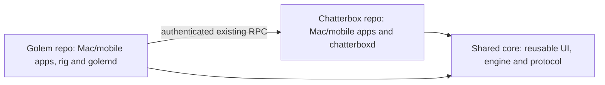

# Separate Golem repository

Shelby requested separate projects/repositories on 2026-10-04. Current baseline `308c681` is clean; another agent worktree at `6f00428` is preserved. Investigation: project.yml Golem compiles Chatterbox except its entrypoint, ChatterboxRuntime, Shared and GolemApp; GolemMobile compiles ChatterboxMobile and Shared with GOLEM_APP. GolemService also compiles engine/runtime source. Moving folders alone would break builds.

## Proposed boundary

User authorized execution of the recommended shared code plan. Selected pinned shared-source Git package, preserving existing compilation flags rather than introducing an incompatible SwiftPM module. Repository visibility must match existing source visibility; verify it before remote creation. No remote repositories created yet. No source or service changes yet.

## Execution
Linear in this Codex session; handoff identifies GPT-6.1-Sol Medium. Local plan tracking respects standing no-GitHub-issue-mutation instruction. Readiness R1-R13 pass: scope confirmed, diagram, checks and rollback recorded; shared ownership and complete target dependency map verified.

- [x] SPLIT1: settle shared ownership; map every target's source/resources/framework dependencies and tests; identify framework/package boundaries including GOLEM_APP compilation conditions.
- [ ] SPLIT2: prepare isolated Golem repository at /Users/shelbyklein/Vibes/Golem and shared component with pinned dependency, retaining original source/history; generate independent Xcode projects. Verify fresh-checkout independence, not sibling path assumptions.
- [ ] SPLIT3: build both Mac apps/services and both universal mobile apps; run protocol, mobile, lifecycle and rendering regressions with fixture data; inspect Golem screens.
- [ ] SPLIT4: only after independent builds pass, remove migrated targets/assets from Chatterbox, commit/push scoped repositories and update docs/install scripts. Preserve unrelated worktrees.
- [ ] SPLIT5: deploy compatible UI binaries under standing authorization; report exact installs separately. Do not adopt/migrate data or reactivate paused automation.

Success: independent Git/build/release roots; reusable code has a single explicit source of truth if selected; existing bundle IDs/APNs topics, pairing, user files, runtime paths, provider sessions and functionality remain compatible. Exclude new services/accounts, production network changes, paid calls, deleting original history, reactivating automation and moving user data. Backup bundles before install. Rollback code/projects using preserved baseline; installed compatible bundles restored without starting legacy writers against daemon-owned data.
