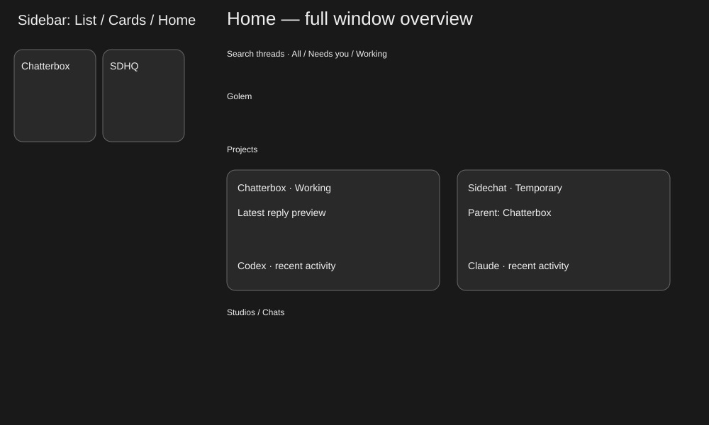

# Mac cards and Home

local: plans/mac-home.md

Mac currently offers sidebar lists only (ContentView.sectionList), while iOS has a two-column card toggle. Add a persisted Mac sidebar List/Cards toggle and a Home surface occupying the full window, with larger thread cards showing real previews, attention/running status, activity age and family details. Extend the existing neutral native appearance and Codex/Claude branding.

Current reference: [sidebar](/Users/shelbyklein/Chatterbox/Screenshots/sidechat/sidebar.png). Target: .

Success: native renders show readable cards at 230pt sidebar and 640/1200pt Home; all active threads appear once on Home including collapsed Studios, worktrees and Sidechats; selecting a card opens that exact existing thread without changing its draft/history; list/card preference persists.

Deliverables: scoped source, tests, screenshot proofs and this plan committed/pushed; Mac built/installed/restarted under standing authorization. No mobile update.

| Task | Acceptance |
| --- | --- |
| HOME1 | Implement shared cards, persisted sidebar toggle, full-window Home entry and return; preserve row menus and family identities. |
| HOME2 | Build; isolated fixture coverage of groups/search/filters/navigation/persistence, native renders narrow/wide and light/dark inspected. |
| HOME3 | Commit/push/install; verify installed bundle and app runtime. |

- [x] HOME1
- [x] HOME2
- [x] HOME3

Boundaries: no transcript, folder, provider, permissions or routing changes; no automatic agent requests; preserve other worktrees. Cards retain row context menus. Home ignores sidebar collapse state so threads remain discoverable; sidebar keeps grouping and collapse controls. No blocking questions.

Rollback: revert scoped commit and reinstall prior app bundle backed up before install. UI preference can be reset without affecting chat data.

Test: scripts/test-mac-home.sh against production Debug module with isolated data/ports and automatic Golem jobs disabled; render ContentView sidebar and Home, click actual native controls. Build via xcodebuild; install via scripts/install.sh.

Work preparation: confirmed by direct implementation request; linear GPT-6.1-Sol Medium (current requested executor), one UI dependency chain; readiness R1–R13 pass. GitHub issue writes excluded by standing user instruction; tracking local. Execute now under existing authorization.

Verification: Debug build passes. scripts/test-mac-home.sh passes on fixture /tmp/chatterbox-mac-home.Mg36yS: complete unique active groups (including Golem, collapsed Studio, worktree and Sidechat), search/attention/working filters, native List/Cards/Home/card clicks, persisted Cards preference on remount, exact parent record/draft preservation, sidebar card bounds at 230pt and Home at 640/1200pt. Production ContentView renders inspected in dark/wide and light/narrow; production Assets.car used. Fixture has no Golem avatar folder, so his head uses the existing fallback. Right-click menu actions and VoiceOver speech not manually exercised; cards use the original row context menu.

Proofs: [Home wide](/Users/shelbyklein/Chatterbox/Screenshots/mac-home/home-wide.png), [Home narrow](/Users/shelbyklein/Chatterbox/Screenshots/mac-home/home-narrow.png), [sidebar cards](/Users/shelbyklein/Chatterbox/Screenshots/mac-home/sidebar-cards.png).

Delivery: f5f7211 pushed to origin/main. scripts/install.sh succeeded; signed Mac app replaced and reopened (PID 13646). Installed Debug dylib matches built code byte-for-byte; authenticated local /v1/chats returned HTTP 200. Installed UI has not been manually clicked; visual and native interaction proof is from the isolated production-view harness. Other worktrees preserved.
