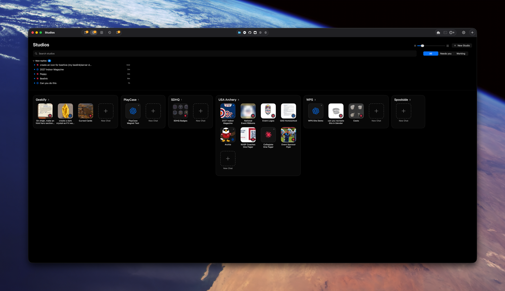

# Studios page: pinned contact sheet + studio inspector

Tracking: https://github.com/shelbyklein/chatterbox/issues/40

## Summary

The Mac Studios page is a dense grid of small tiles, so it's hard to see what each Studio session looks like or what state it's in. We'll replace it with one page that has a studio list on the left. **Pinned** (the default) shows pinned studio sessions as large preview cards grouped by studio. Picking a studio opens an inspector: a compact session list beside a large preview of the selected session, with its status and latest reply. The Activity strip (Working + New replies) moves to the bottom of the left column.

## Problem

Today Home *is* the Studios page (`Core/Chatterbox/Views/ChatHomeView.swift:346`; `page` is fixed to `.studios` at line 360). It renders a "New replies" strip at the top (`UnseenRepliesStrip`, line 378) and then every Studio as a flow of small icon tiles with a size slider (`studioGroups`, line 413; `StudioGroupFlow`, line 314). It affects Shelby, who uses Studios for visual work across clients (USA Archery, Geekify, …):

- **Tiles are too small to read:** each one is about 80pt × 1.6, and the image is decoded at only 160px (`ThreadThumbnails.thumbnail(url, side: 160)`, line 555). Enlarging it blurs.
- **Status is a tiny dot:** status shows only as a dot plus hover text (`ThreadCard.activityIndicator`, line 37). The status string exists (`ThreadCard.status`, line 30) but isn't visible on tiles.
- **No focus or detail view:** nothing separates the sessions Shelby cares about from the rest, and no view shows one session's latest output large.

Current screenshot: 

## Target

Wireframe of both states: [assets/studio-inspector/target.svg](assets/studio-inspector/target.svg). Approved concepts (statuses and copy were illustrative): [contact sheet](assets/studio-inspector/concept-contact-sheet.png) for Pinned, [inspector](assets/studio-inspector/concept-inspector.png) for a selected studio.

```
┌ STUDIOS ──────┐┌ Studios   [search……………] [All|Needs you|Working] ┐
│ ▸ Pinned  ◀── ││ USA Archery  3 pinned · 1 needs you               │
│   USA Archery ││ [ big preview ][ big preview ][ big preview ]     │  A: Pinned
│   Geekify     ││  ●Ready  title  ●Working title  ●Needs you title   │
│   …           ││ Geekify  1 pinned                                 │
│ + New Studio  ││ [ big preview ]                                   │
│───────────────│└───────────────────────────────────────────────────┘
│ ACTIVITY      │┌ USA Archery             + New Chat · Instructions ┐
│ ● Working …   ││ [thumb] title  ││  title               ●Ready     │  B: studio
│ ● New reply … ││ [thumb] title  ││  [ newest image, full res ]     │     selected
└───────────────┘│ [thumb] title  ││  ●status · latest reply · age   │
                 │                ││                   [Open chat]   │
                 └───────────────────────────────────────────────────┘
```

### Settled decisions

- **One page** replaces the current Studios page in the same place (`model.showingHome`, `ContentView.swift:157`). The left column lists **Pinned** first, then each active Studio with its session count, then **New Studio**.
- **Pinned** means existing session pins (`AppModel.pinnedThreadIDs`, `AppModel.swift:96`; "Pin to Top" in the card menu at `ContentView.swift:608`), limited to sessions with a `studioID` and grouped under their Studio in Studio order. Studios with no pinned sessions don't appear.
- **Activity:** the existing `SidebarActivityStrip` (`ChatControls.swift:467`) sits at the bottom of the left column in both states. The top-of-page `UnseenRepliesStrip` is removed from this page.
- **Clicking a Pinned card** selects that Studio in the left column and that session in the inspector. Double-click, or the inspector's **Open chat**, uses the existing open-session path the cards call today.
- **Status and notes come from existing data:** no agent or prompt changes.
  - Status pill, in priority order: **Needs you** (`isWaitingOnYou`), **Working** (`isRunning` or `hasBackgroundWork`), **Ready to review** (unread in `Attention.shared.unread`), **Idle** (anything else).
  - The note is the first sentence of the latest assistant reply (`ChatSession.firstSentence`, already used by `ThreadCard.preview`), plus an age from `lastActivity`.
  - The preview label reads "Image from 2m ago", from the timestamp of the newest image item.
- **Large previews** use a second, larger decode of the same newest image `ThreadThumbnails` already finds (`latestThumbnailURL()`), loaded on demand for visible cards and the inspector. The 160px tiles stay for the sidebar.
- **The selected left-column entry** (Pinned or a Studio ID) and each Studio's selected session are saved in `@AppStorage`, falling back to Pinned when a saved Studio no longer exists.
- **Search and the All / Needs you / Working filter** stay in the page header and filter whichever state is showing.
- **The card-size slider goes away**, since card and preview sizes adapt to the window width.

## Success criteria

1. Opening Studios lands on Pinned. Pinned studio sessions appear as large cards grouped by Studio, each with a visible status pill, title and note, and the Activity strip sits at the bottom left. Verified by `scripts/test-mac-home.sh` and an inspected native render.
2. Selecting a Studio shows the inspector: every session in that Studio, a large preview of the selected one at full resolution (no 160px upscale), status, latest reply and Open chat. Verified by `scripts/test-mac-home.sh` (decoded preview at least 1000px on its long side for a 2000px source) and an inspected render.
3. Clicking a Pinned card opens that session in its Studio's inspector, and double-click or Open chat opens the chat. Verified by native clicks in `scripts/test-mac-home.sh`.
4. Existing behavior still works: card right-click menus, pin/unpin, New Studio, New Chat in a Studio, Studio instructions, search/filter, back/forward history and the chat sidebar. Verified by `scripts/test-mac-home.sh`, `scripts/test-sidebar-pins.sh`, `scripts/test-studio-chat-sidebar.sh` and `scripts/test-home-thumbnails.sh` all passing.
5. After the go-ahead, the installed app shows the new page. Verified by launching it and capturing the Studios page in both states.

## Deliverables

| Item | End state |
|---|---|
| Core changes (new page views, status helper, large-preview loader) | Committed on a Core branch, pushed to `chatterbox-core` |
| Chatterbox submodule pin, updated native tests and rendered screenshots | Committed on `studio-view`, pushed |
| Mac build (`build/DerivedData`) | Built |
| Installed app | **Waits for Shelby's go-ahead**, because installing restarts the app Shelby chats in |
| Issue checklist | Updated as tasks finish; closed after verification |

## Workflow

Before SI1: Core in this worktree is a detached checkout at `7f93174`, so create a Core branch `studio-inspector` from it.

| ID | Task | Acceptance check |
|---|---|---|
| SI1 | Add a `StudioSessionSummary` helper: status (Needs you / Working / Ready to review / Idle, in that priority), latest-change note, `lastActivity` age, newest-image date | Unit cases in `tests/mac-home` pass for each status priority, a session with no replies ("No replies yet"), and a session with no images (no image age) |
| SI2 | Add a large-preview decode to `ThreadThumbnails` (on demand, keyed by the same source URL, one cache entry per session). Leave 160px tiles unchanged | `scripts/test-home-thumbnails.sh` passes, with a new case: a 2000px source gives a large preview at least 1000px on its long side, and the small thumbnail is still 160px or smaller |
| SI3 | Build the page shell in `ChatHomeView`: left column (Pinned, Studios with counts, New Studio, `SidebarActivityStrip` at the bottom), header with search and filter, saved selection. Remove the top `UnseenRepliesStrip` and the size slider | Native test: the page opens with Pinned selected, the Activity strip frame sits at the bottom of the left column, a saved Studio selection survives reopening, and a deleted Studio falls back to Pinned |
| SI4 | Pinned contact sheet: studio-session pins grouped by Studio, large adaptive cards with a status pill over the preview, title and note; empty state ("Pin a Studio session to see it here", with a hint to use Pin to Top) | Native test with 2 Studios × 2 pinned plus 1 unpinned: shows 4 cards in 2 groups and no unpinned card; with no pins it shows the empty state; card right-click shows Unpin |
| SI5 | Studio inspector: session list (thumbnail, title, status, note, age) beside a large preview, status, latest reply, Open chat, New Chat and Instructions. Sessions without images show the provider icon placeholder | Native test: selecting a Studio lists all of its sessions, with the first selected by default; selecting another updates the preview title; Open chat makes it the selected chat |
| SI6 | Navigation: a Pinned card click jumps to its Studio with the session selected, and double-click opens the chat. Search and filter apply to both states. Back/forward history works | Native clicks in `scripts/test-mac-home.sh` cover single-click (inspector shows that session), double-click (chat opens), and the "Needs you" filter (only matching cards and rows) |
| SI7 | Rendered check: capture the production page at 1600pt and 900pt wide, in both states, plus the empty-Pinned and Studio-without-images cases. Inspect for overlap, clipping and blurry previews. Save to `plans/assets/studio-inspector/rendered/` | Screenshots exist and are inspected. No overlapping or clipped elements, and previews are sharp |
| SI8 | Run all suites (Test plan), build, then commit and push Core and the Chatterbox pin | Suites pass, and both pushes are confirmed by `git log origin/...` |
| SI9 | **Gate: Shelby's go-ahead to install.** Then run `scripts/install.sh` and capture the installed Studios page in both states | Installed app shows the new page, and the captures are inspected |

## Scope boundaries

Not included:

- Mobile (`ChatterboxMobile`)
- Command Center
- Projects, Chats and Archive pages
- The chat sidebar's own layout, other than continuing to use the same Activity strip
- Agent prompts or runtime-written summaries
- A "pin a whole studio" feature

Must not change:

- Saved pins (`macPinnedThreads`), Studios data and chat records
- Drafts, the archive and provider state
- Card right-click actions, the Studio instructions sheet, the New Studio and New Chat flows, and `HomeThreads.groups` results for other callers (such as Command Center)

## Rollback

Applies because of the install, not data. No stored data or schema changes: the only additions are two `@AppStorage` keys for the selection, and leftovers are harmless. To undo, revert the Chatterbox commit that moves the Core pin (or check out the previous pin `7f93174`) and reinstall with `scripts/install.sh`. Note the previous installed commit before SI9.

## Test plan

- `scripts/test-mac-home.sh`, extended for SI1 and SI3–SI6. It drives the real `ChatHomeView` entry point (`model.showingHome`, reached from the Studios toolbar button) and checks native clicks and frames.
- `scripts/test-home-thumbnails.sh`, extended for SI2.
- `scripts/test-sidebar-pins.sh`, a regression check for pin/unpin.
- `scripts/test-studio-chat-sidebar.sh`, a regression check for the Studio chat sidebar and Activity strip.
- Rendered state (SI7): native captures of the production view, in both states, at wide and narrow widths, inspected by eye.
- Installed (SI9): capture after install, once Shelby has approved it.

## Open questions

None blocking. To revisit after seeing it rendered:

- Whether "Idle" sessions should show a pill at all, or nothing
- Whether to add an "All studios" entry (all sessions across Studios in the inspector list)

## Work preparation

- **Scope:** confirmed by Shelby in chat on 2026-10-08. It's one page: the left column holds Pinned plus Studios, with Activity at the bottom of both states. Pinned uses existing session pins. Notes are derived from data.
- **Plan:** `plans/studio-inspector.md`. Tracking: https://github.com/shelbyklein/chatterbox/issues/40
- **Mode:** `linear`. The tasks share `ChatHomeView.swift` and the mac-home test, so parallel lanes would conflict on the same files.
- **Models:** linear executor Opus 5.5 (`claude-opus-5-5`), high effort.
- **Handoff:** n/a (linear)
- **Now or later:** not yet decided
- **Readiness:** see below.
- **Remaining questions:** none blocking.

Readiness: pass · 2026-10-08 · R1–R11, R13 pass · R12 applies to the install only (no data or schema change), rollback documented
