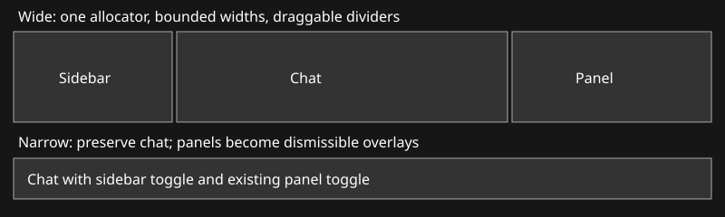

# One bounded Mac column layout
The current nested NavigationSplitView/inspector negotiates intrinsic widths independently. In a native Golem run it requested 1256pt inside an1100pt window, clipping both outer panels. Replace these with one allocator using the actual window proposal, explicit clipped pane bounds and persisted divider widths. Preserve conversation, toolbar controls, files, terminal and the separate mini.

Tracker: local:BD0654FD-7A0C-4AB9-8461-FD3E9A6A675F
Baseline: 3743ddd in registered layout-fix worktree. Existing failure report: tests/split-layout/verification-2026-10-03.md; screenshot /Users/shelbyklein/Chatterbox/Screenshots/mac-layout-verification/golem-1100.png.

COL-1: One width allocator; pure tests sweep window/panel widths and retain a400pt chat whenever possible. Sidebar preferred260/min230, inspector per kind; explicit resize handles with persistence and accessibility. At insufficient widths, sidebar collapses behind its toolbar toggle and inspector becomes a closeable overlay; no off-window views. No nested split/inspector in the main chat.
COL-2: Real native Golem and regular-chat/Issues/web captures at1600/1100/950/800/640, delayed inspector opening and real resize/toggle events. Assert measured pane bounds rather than only building. Use isolated copies with automatic agent turns disabled, same snapshots for before/after where needed. Inspect screenshots.
COL-3: Build, scoped commit/merge/push and Mac install under standing authorization; verify actual installed binary, API and background helper. Retain worktree. No mobile rebuild needed.

Success: no outer clipping in policy or native tests, chat controls retained, narrow panels recoverable, persisted user widths. Deliver code/tests/proof committed and installed; remaining interactions explicitly reported.
Boundaries: no transcript/model/permission changes, no hosted agent calls or paid services, no unrelated branches. Rollback via prior app backup and scoped git revert; old sidebar preferences retained. No blocking decisions. Linear GPT-6.1-Sol Medium as user requested after Fable handoff; R1-R13 pass for authorized implementation. Run scripts/test-unified-columns.sh then signed Mac build. Stored width keys are additive; no schema migration.

## Verified results
2532 policy cases pass. Native run passes at640/800/950/1100/1600pt with copied Golem and regular chats, actual Issues view and local WKWebView. Real divider drag changes260to300pt; sidebar hide/restore and chat switching retain that width; actual close-button mouse events dismiss both Issues/Web overlays. No NSSplitView remains in native hierarchy.
At1100pt Golem: sidebar260, chat508, inspector320 plus12pt handles, exactly1100. At800: sidebar collapsed, chat474, inspector320 plus6pt. At640: chat640, panel is an in-window overlay.

Verification scope: mouse handler drag and actual overlay clicks exercised; sidebar restore invoked via production request path. Actual toolbar sidebar click, VoiceOver traversal, secondary physical screens and dragging right divider were not independently exercised.
